<p align="center">
    
    <h2 align="center">Rosé Pine for App</h2>
</p>

<p align="center">All natural pine, faux fur and a bit of soho vibes for the classy minimalist</p>

<p align="center">
    <a href="https://github.com/rose-pine/rose-pine-theme">
        
    </a>
</p>

## Usage

1. Open Surfingkeys options page `;e`
2. Checked Advanced mode
3. Copy paste [`dist/rose-pine.js`](./dist/rose-pine.js) or `loaded settings from` GitHub raw URL

> Eg. https://raw.githubusercontent.com/thuanowa/surfingkeys/main/dist/rose-pine.js

## Gallery

### Rosé Pine


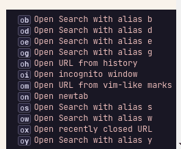
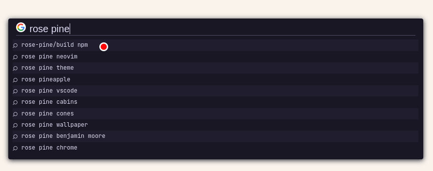
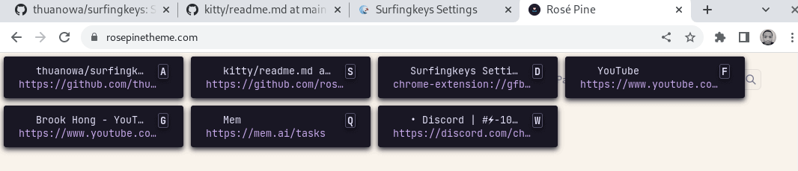
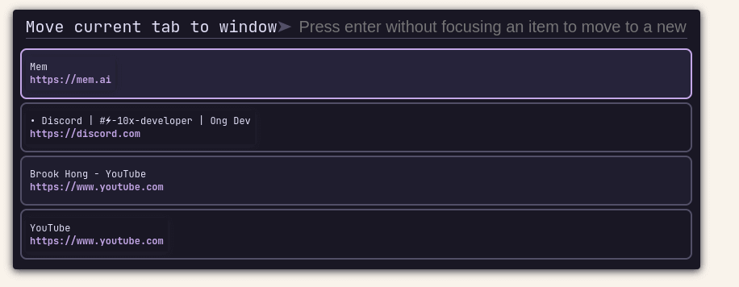
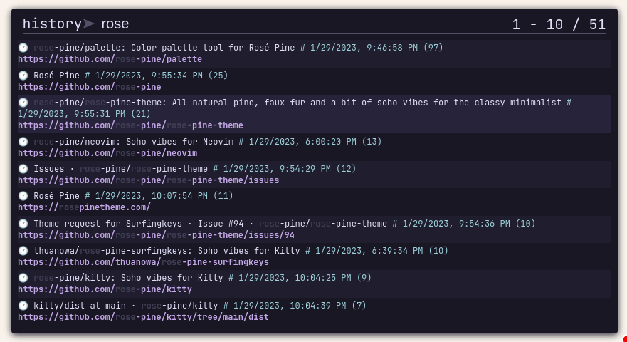


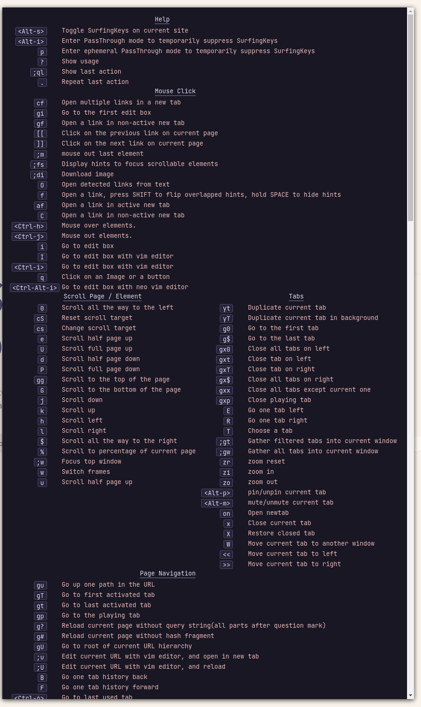
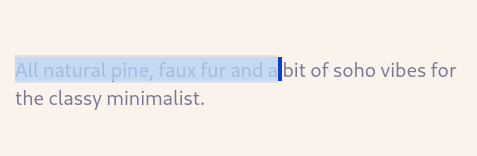

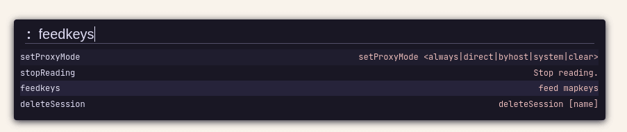

### Rosé Pine Moon

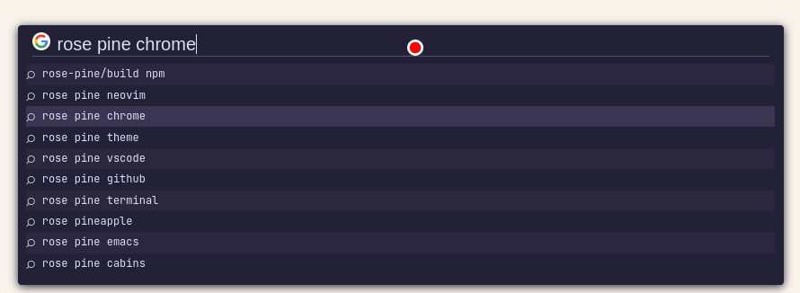
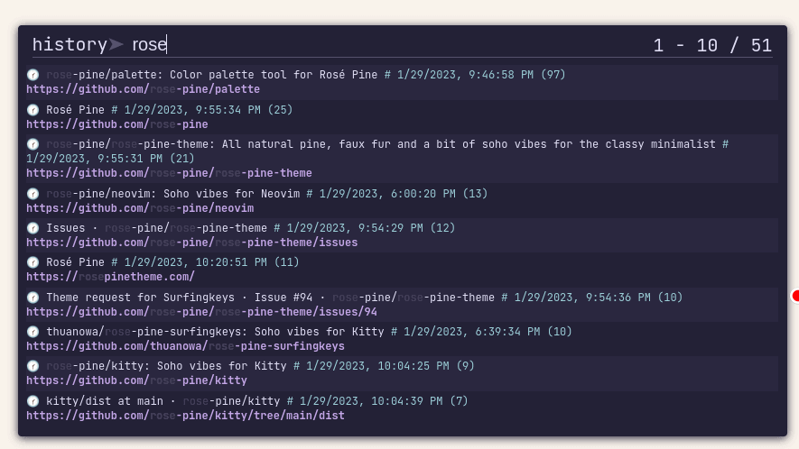
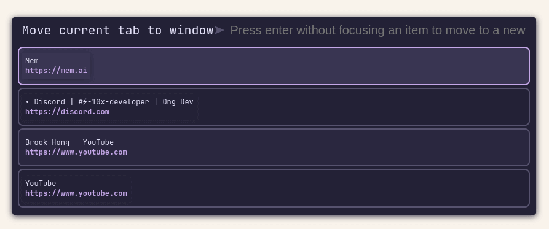
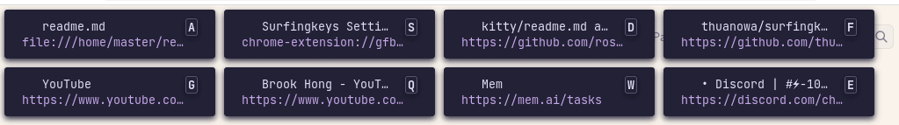

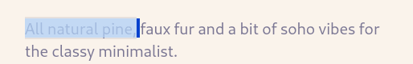
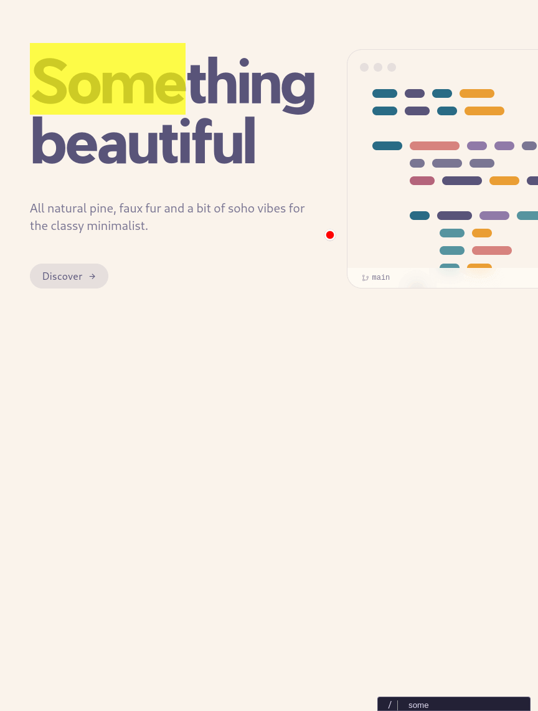

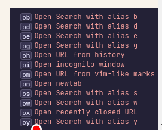


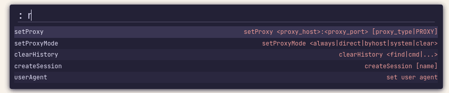

### Rosé Pine Dawn

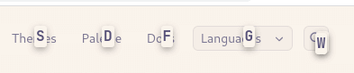
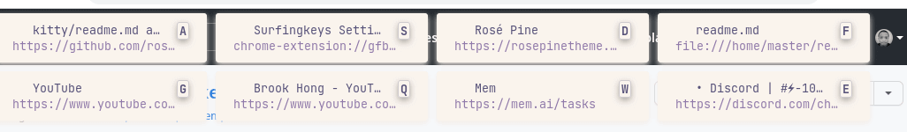
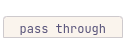
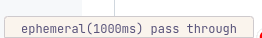
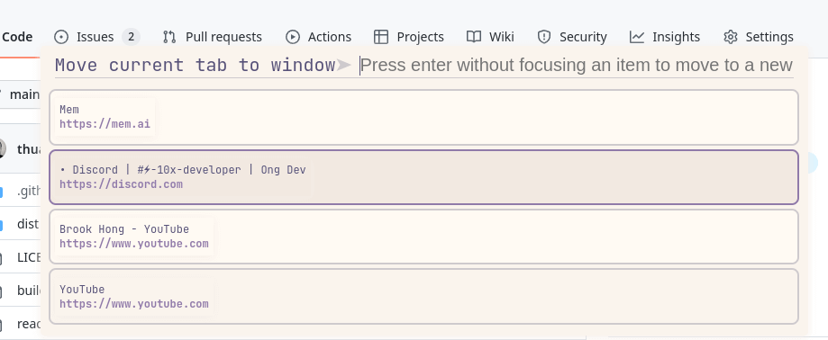
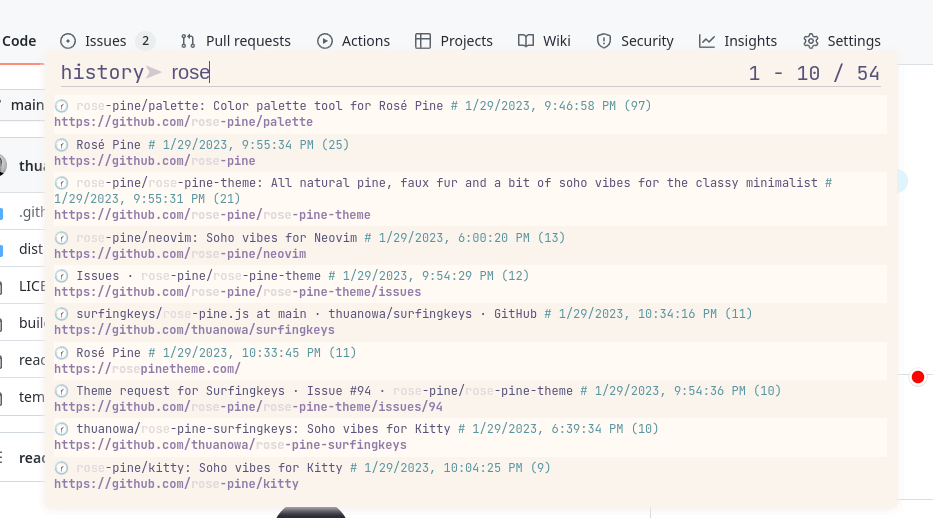
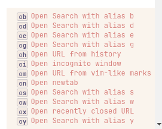
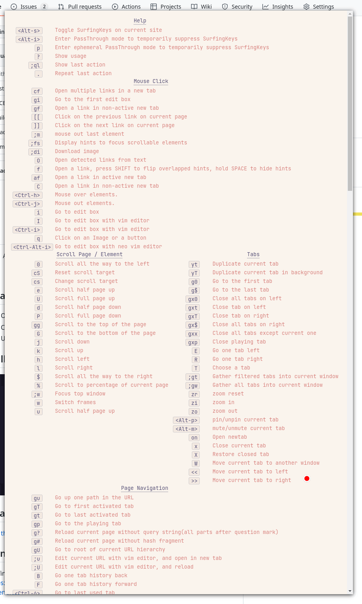
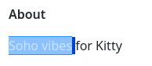
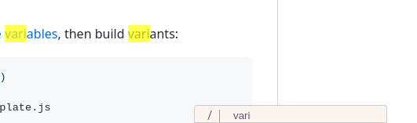
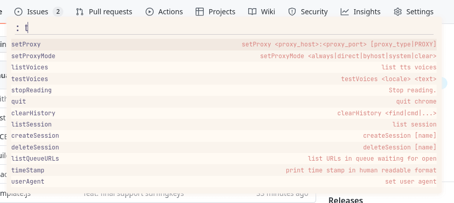
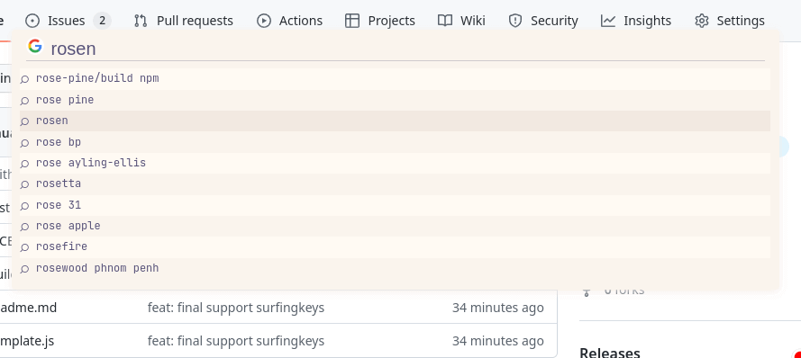

## Thanks to

- [thuanowa](https://github.com/thuanowa)

## Contributing

Surfingkeys front-end: https://github.com/brookhong/Surfingkeys/blob/master/src/content_scripts/ui/frontend.css

Modify `template.json` using [Rosé Pine variables](https://github.com/rose-pine/build#variables), then build variants:

```sh
cd $(git rev-parse --show-toplevel)
rm -rf dist/
npx @rose-pine/build@latest -t template.js

# Or

./build
```

_Generated by @rose-pine/build@0.5.1_
